[English](./README.en.md) · [Website](https://ofdcli.lei6393.com) · [GitHub](https://github.com/SuperMarioYL/ofdcli)

<picture>
  <source media="(max-width: 600px) and (prefers-color-scheme: dark)" srcset="./assets/presentation/hero-mobile-dark.svg">
  <source media="(max-width: 600px)" srcset="./assets/presentation/hero-mobile-light.svg">
  <source media="(prefers-color-scheme: dark)" srcset="./assets/presentation/hero-dark.svg">
  
</picture>

# ofdcli

**从命令行读取 OFD 文档。**

ofdcli 打开 OFD ZIP/XML 容器，将文本块与页面边界输出为结构化 JSON。

## 为什么需要它

自动化通常需要文档文字和布局坐标，而不必打开办公应用。小型 CLI 为脚本提供明确输入路径与机器可读结果。

- **面向脚本的 JSON** — 文本块和坐标可供程序读取。
- **本地文档处理** — CLI 直接处理本地归档。
- **统一支持模型** — 读取、元信息与回写共用文档结构。

## 架构

<picture>
  <source media="(max-width: 600px) and (prefers-color-scheme: dark)" srcset="./assets/presentation/architecture-mobile-dark.svg">
  <source media="(max-width: 600px)" srcset="./assets/presentation/architecture-mobile-light.svg">
  <source media="(prefers-color-scheme: dark)" srcset="./assets/presentation/architecture-dark.svg">
  
</picture>

读取器打开归档，沿 OFD 清单、文档和页面 XML 建立 OfdDocument。read 将文本块投影成 JSON，info 汇总结构，write 将已支持的模型重新写成 OFD 容器。

| 组件 | 职责 |
| --- | --- |
| `OFD archive` | pkg/ofd/reader.go |
| `XML parser` | pkg/ofd/parser.go |
| `Document model` | pkg/ofd/document.go |
| `Read / info / write` | cmd/ofdcli |

## 安装与快速上手

使用仓库清单指定的运行时版本构建，并在仓库根目录运行示例。

```bash
git clone https://github.com/SuperMarioYL/ofdcli.git
cd ofdcli
go build ./cmd/ofdcli
```

对完整的 examples/sample.ofd 归档运行 read，检查两页文本块。

```bash
go run ./cmd/ofdcli read examples/sample.ofd
```

## 实际运行示例

<picture>
  <source media="(max-width: 600px) and (prefers-color-scheme: dark)" srcset="./assets/presentation/process-mobile-dark.svg">
  <source media="(max-width: 600px)" srcset="./assets/presentation/process-mobile-light.svg">
  <source media="(prefers-color-scheme: dark)" srcset="./assets/presentation/process-dark.svg">
  
</picture>

The sample document produces two pages of text blocks with millimeter boundaries.

```text
{"pages":[{"page":1,"id":"Page_0","blocks":[{"text":"关于召开项目推进会的通知","boundary":[56.7,20,96.6,40]},{"text":"各有关单位：","boundary":[20,80,170,12]}]},{"page":2,"id":"Page_1","blocks":[{"text":"会议时间：2026年9月1日","boundary":[20,20,170,12]}]}]}
```

完整命令与输出保存在 [docs/demo-results.json](./docs/demo-results.json). 输入和复现代码均随仓提供。

## 用法

CLI 提供以下操作。示例之外的命令需要替换成你的文件路径或标识。

```bash
go run ./cmd/ofdcli read examples/sample.ofd --pretty
go run ./cmd/ofdcli info examples/sample.ofd
go run ./cmd/ofdcli write -i examples/sample.ofd -o sample.normalized.ofd
```

## 配置

read 接收 OFD 路径和可选 --pretty；info 可用 --members/-m 查看归档成员；write 必须提供 --input/-i 与 --output/-o，建议使用不同输出路径保留原件。无需守护进程或办公软件。

## 集成与职责分工

<picture>
  <source media="(max-width: 600px) and (prefers-color-scheme: dark)" srcset="./assets/presentation/integrations-mobile-dark.svg">
  <source media="(max-width: 600px)" srcset="./assets/presentation/integrations-mobile-light.svg">
  <source media="(prefers-color-scheme: dark)" srcset="./assets/presentation/integrations-dark.svg">
  
</picture>

以下路径已有源码实现。按任务选择输入，并把生成的结果与项目一起保存。

| 路径 | 已实现职责 |
| --- | --- |
| OFD ZIP/XML | Container and page tree input |
| Text JSON | Text and millimeter boundaries |
| Info report | Document/page metadata |
| OFD output | Supported model serialization |

## 限制与后续方向

- 回写保留的是支持的模型，不保证任意 OFD 的全部资源与视觉细节。请保留原件，并用实际查看器验证输出。
- 样例为合成文档；解析成功不等于标准认证或法律有效性验证。
- 模板生成、电子签章和计划中的 validate 命令尚未实现。

后续包括模板生成、经查看器验证的布局保真，以及更多格式覆盖。

## 许可与贡献

许可见 [LICENSE](./LICENSE). 反馈问题时请提供最小输入、执行命令和实际输出。
