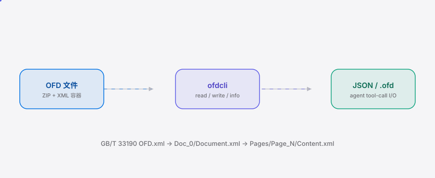

[English](./README.en.md) | **简体中文**

<div align="center">
  <picture>
    <source media="(prefers-color-scheme: dark)" srcset="./assets/hero-dark.svg">
    <source media="(prefers-color-scheme: light)" srcset="./assets/hero-light.svg">
    
  </picture>
</div>

<p align="center"><sub>信创 agent 的 OFD (GB/T 33190) 政务版式文档读写 CLI，单二进制无依赖。</sub></p>

<p align="center">
  <a href="./LICENSE"></a>
  
  
  
  
</p>

> 推荐设置 GitHub topics：`gh repo edit --add-topic ofd --add-topic xinchuang --add-topic gov-doc --add-topic agent-cli --add-topic go`

**信创自动化 agent 卡在 OFD 上 —— ofdcli 让它像读写 Word 一样读写 GB/T 33190 政务版式文档，单二进制、无 Office 依赖、可被 agent 直接调用。**

<h2> 架构</h2>

OFD 是一个 ZIP 容器（与 OOXML 同构），成员为 XML：`OFD.xml → Doc_0/Document.xml → Pages/Page_N/Content.xml`。ofdcli 把这棵树映射为 agent 可调用的 JSON I/O —— 单进程、无服务、无 Kubernetes。

<picture>
  <source media="(prefers-color-scheme: dark)" srcset="./assets/atlas-dark.svg">
  <source media="(prefers-color-scheme: light)" srcset="./assets/atlas-light.svg">
  
</picture>

<h2> 安装</h2>

```bash
go install github.com/SuperMarioYL/ofdcli@latest
```

或从 Release 下载对应平台的单二进制（Linux/darwin/arm64 —— 信创桌面）。无需安装 Office/WPS，无 Python 运行时。

<h2> 快速开始</h2>

```bash
git clone https://github.com/SuperMarioYL/ofdcli && cd ofdcli
go build -o ofdcli ./cmd/ofdcli
./ofdcli read examples/sample.ofd          # 输出结构化 JSON
```

<details><summary>示例输出</summary>

```json
{"pages":[{"page":1,"id":"Page_0","blocks":[{"text":"关于召开项目推进会的通知","boundary":[56.7,20,96.6,40]},{"text":"各有关单位：","boundary":[20,80,170,12]}]},{"page":2,"id":"Page_1","blocks":[{"text":"会议时间：2026年9月1日","boundary":[20,20,170,12]}]}]}
```
</details>

<h2> 用法</h2>

```bash
# 1. 读取 OFD，输出 agent 可消费的结构化 JSON（页 → 文本块 + 边界框，单位 mm）
ofdcli read 红头文件.ofd
ofdcli read 红头文件.ofd --pretty        # 缩进可读

# 2. 查看文档结构与元信息（版本/标题/作者/页数/默认页面尺寸/每页对象统计）
ofdcli info 红头文件.ofd
ofdcli info -m 红头文件.ofd               # 附带归档成员清单

# 3. 读入-回写规范化：经模型回写为合规 GB/T 33190 容器（拷贝/规整/校验）
ofdcli write -i 红头文件.ofd -o 红头文件.norm.ofd
```

每个子命令都是 agent tool-call loop 可直接调用的：`read` 产出 JSON 到 stdout，`write` 从 `-i` 读入并写到 `-o`，`info` 给 agent 一个结构概览。子命令列表见 `ofdcli --help`。

<h2> 工作原理</h2>

OFD（Open Fixed-layout Document，GB/T 33190）是国政务版式/归档/交换的强制格式，用于红头文件、合同、发票等。它本质是 **ZIP + XML**，结构如下：

```
红头文件.ofd                          # 一个 zip
├── OFD.xml                           # 容器清单：DocBody -> DocRoot 指向 Document.xml
└── Doc_0/
    ├── Document.xml                   # 文档结构：Common + Pages 列表
    └── Pages/
        ├── Page_0/Content.xml        # 页内容：Area + Content -> Layer -> 对象
        └── Page_1/Content.xml
```

`Content.xml` 的页树是 `Layer -> TextObject / PathObject / ImageObject`。`TextObject` 持 `Boundary`（"x y w h"，mm）与 `TextCode`（字形串）；ofdcli 把它投影成 agent 可调用的 JSON `{pages:[{page, blocks:[{text, boundary}]}]}`。

与全球的 OfficeCLI（29k★，单二进制读写 Word/Excel/PPT）同构，但它不覆盖中国政务格式 —— OFD 是独立国标，与 OOXML 无关。ofdcli 填的正是这条 China surface：同一个 agent-CLI 形状，面向政务实际强制使用的版式文档。

<h2> Demo</h2>


> demo 由 `docs/demo.tape`（vhs 脚本）驱动，经 `.github/workflows/demo.yml` 渲染为 `assets/demo.gif`。首版 gif 在首次 tag / 手动触发 workflow 后生成。

<h2> 企业版</h2>

OSS 核心（read / write / info，单模板，自托管）永久免费 —— 信创 = data 不出境，二进制即部署单元。

**企业版**（按团队授权，on-prem license-gated）面向系统集成商 / 政企 IT 自动化团队，提供：

- 批量 OFD 生成（红头文件 / 合同 / 发票，OSS 核心仅附单模板种子）
- 模板包（红头文件 / 合同 / 发票版式模板）
- 合规审计日志（每条 read/write 留痕，满足政务审计）
- 优先格式修复支持

价格区间参考：团队授权 ¥3,000–8,000/年（5 席）；项目 PoC / 集成许可 ¥10,000–50,000。走对公发票 / license-key，非 SaaS。通过阿里云 / 华为云 marketplace（国产云）分发入围。如需评估，提一个 issue 或对公联系。

<h2> 路线图</h2>

- [x] **m1 — 读取 OFD**：解析 GB/T 33190 ZIP 容器，提取 `Doc_0/Document.xml` 结构化文本 + 页布局，输出 JSON
- [x] **m1 — 回写 OFD**：模型 → 合规 XML → 规范化 zip（读入-回写 round-trip，已通过单测）
- [ ] **m2 — 模板生成**：`ofdcli write --template 合同 --data contract.json -o 合同.ofd`，经数科/福昕查看器合规校验
- [ ] **m3 — agent CLI**：cobra `read`/`write`/`validate` 子命令 + JSON stdin/stdout tool-call surface + asciinema demo + Gitee 镜像
- [ ] **v0.2 — WPS 原生格式**（`.et`/`.wps`/`.dps`）读写（拿到真实样本 de-risk 后）
- [ ] **v0.3 — 电子签章 / 印章**密码嵌入

当前版本为 **m1**：读取与读入-回写已实现并测试通过；模板生成（m2）与 validate 子命令（m3）为路线图。

<h2> License</h2>

MIT，详见 [LICENSE](./LICENSE)。欢迎提 issue 或 PR。

<p align="center"><sub><a href="./LICENSE">MIT</a> © 2026 SuperMarioYL</sub></p>
